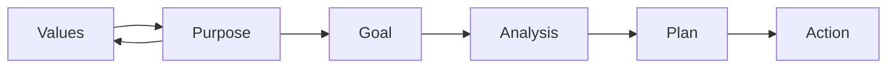

# The Harada Method

## Overview

The focus of this method is to achieve complete [[self-reliance]]. By the end of the method we should be able to master what is they hope to achieve and make a consistent and continued effort to improve making it easier as time goes on. 

## Goal

This is how you start veering towards where you would like to be. You set your goal in line with your purpose, which is laying the foundation for everything.

Use your [[Values | values]] in tandem with your goal in a recursive process as seen above.

### Purpose 

Connecting [[your values with your goals]] will help understanding *why* and *what* you are doing **that is authentic to you**.

### Analysis 

The analysis phase exists so that you can learn from the past, work towards your strengths and begin to strategise a plan where the path is clear enough for you to get to where you wanna be. There will be risks and uncertainties but we will see them ahead of us in this process.

### Plan 

Build an action plan. You will stretch your imagination and [[list 64 tasks]] to accomplish your goal.

### Action 

Incorporate your plan into your daily life, make yourself accountable for your actions, and sustain your efforts.

### [[The Twenty Steps]]